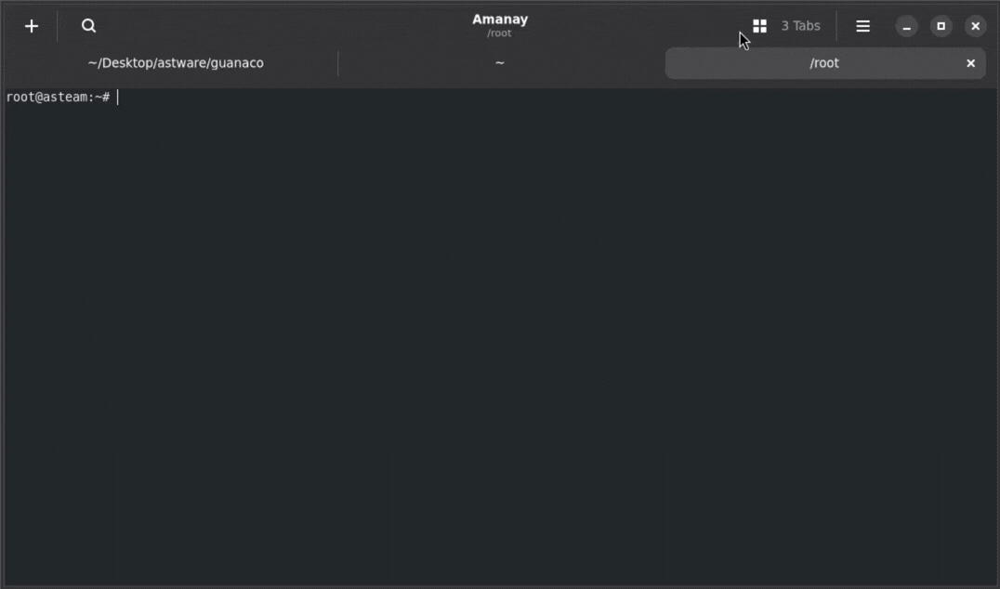

# Amanay

<p align="center">
  A disciplined GTK4 terminal emulator built in C.
</p>

<p align="center">
  <a href="docs/media/Amanay.mp4">
    
  </a>
</p>

<p align="center">
  
  
  
  
  
  
  
  
</p>

---

A disciplined GTK4 terminal emulator built in C.

Amanay is part of the Light Desktop Stack (LDS):
a small, controlled, and maintainable desktop stack built for predictable
behavior. 

It is designed for **real daily use**, not feature accumulation.

---

## What it does

- Tabs and vertical splits
- Text search with match count
- URL detection and opening
- Configurable shortcuts
- Runtime diagnostics for long sessions
- `--geometry`, `--title`, `--working-directory`, `--command` flags
- `--no-remote` for independent instances

## What it does not do

Amanay is not a GNOME Terminal clone. 
It is not a feature-heavy terminal.

Horizontal splits, nested pane trees, themes, plugins, and scripting APIs are
outside its scope by design.

---

## Dependencies

| Dependency | Minimum version |
|---|---|
| GTK4 | 4.12 |
| Libadwaita | 1.4 |
| VTE (`vte-2.91-gtk4`) | 0.74 |
| Meson | 1.0 |
| Ninja | 1.10 |
| GLib / GIO | 2.78 |

On Debian/Ubuntu:

```sh
sudo apt install \
  libgtk-4-dev \
  libadwaita-1-dev \
  libvte-2.91-gtk4-dev \
  meson \
  ninja-build
```

On Fedora:

```sh
sudo dnf install \
  gtk4-devel \
  libadwaita-devel \
  vte291-gtk4-devel \
  meson \
  ninja-build
```

---

## Build

```sh
meson setup build
meson compile -C build
```

Run after building:

```sh
./build/src/lds-terminal
```

Install system-wide:

```sh
meson install -C build
```

### Build options

| Option | Default | Description |
|---|---|---|
| `strict_build` | `true` | Treat warnings as errors (`-Werror`) |
| `default_renderer` | `cairo` | GSK renderer: `auto`, `cairo`, `ngl`, `vulkan` |
| `tests` | `true` | Build test targets |
| `system_check_policy` | `warn` | Unsupported host: `warn` or `error` |

Example:

```sh
meson setup build -Ddefault_renderer=ngl -Dsystem_check_policy=error
```

---

## Tests

```sh
meson test -C build --print-errorlogs
```

The suite covers lifecycle, concurrency, settings consistency, search policy,
link detection, and several regression scenarios.

---

## Diagnostics

Set `LDS_TERMINAL_DIAG=1` to enable runtime diagnostics output.

```sh
LDS_TERMINAL_DIAG=1 lds-terminal
```

Useful for debugging hangs, shutdown ordering issues, or unexpected behavior
under sustained use.

---

## Naming

- `Amanay` is the user-facing name.
- `lds-terminal` is the technical identity: application ID, executable, schema,
  resource prefix, and `WM_CLASS`.

Do not mix them. 

The `tools/identity_guard.sh` script enforces this and runs on every push via CI.

---

## Architecture

- Command-line parsing is separated from runtime setup
- Window management stays isolated from terminal widget logic
- Search, links, tabs, settings, and diagnostics live in dedicated modules
- The VTE layer is treated as a controlled subsystem, not the whole app
- Ownership and teardown are explicit, so lifecycle transitions stay bounded

Full architecture notes: [`docs/DESIGN.md`](docs/DESIGN.md)

---

## Contributing

See [`CONTRIBUTING.md`](CONTRIBUTING.md).

Run before submitting:

```sh
tools/check_comment_policy.sh
meson compile -C build
meson test -C build --print-errorlogs
tools/identity_guard.sh
```

---

## License

MIT — see [`LICENSE`](LICENSE).
